# SpriteMCP

SpriteMCP is a pixel-art character toolkit for creating and animating consistent side-view characters.

Drawing each sprite manually gives precise control, but building outfits and multiple animation frames is slow and repetitive. AI Image generators are faster and can explore creative ideas, but their outputs are harder to keep structurally consistent across poses and frames.

SpriteMCP combines the two approaches: the agent can use its generative capabilities to design and iterate on the character, while the toolkit provides a structured pixel-art workflow with a shared armature, editable layers, and deterministic animation.

It provides a Python API and an MCP server for Cursor and other MCP clients.

## Demo

The prompts shown above are the initial requests given to the agent. The final results were not produced in a single pass.

Each demo required roughly five iterations of prompting and refinement to reach the final result. The iteration included reviewing generated output, adjusting the request, and correcting details in the character design or animation.

### Samurai

**Initial prompt**

> Side-view samurai, sepia palette. Light skin. Yellow cloth (kimono and hakama). Blue armor on chest, shoulders, forearms, leg plates, and boots. Blue conical jingasa with a straight lower edge, covering the upper half of the face. Orange details/accents. Hard one-step-darker shading (no gradients), light from top-front.

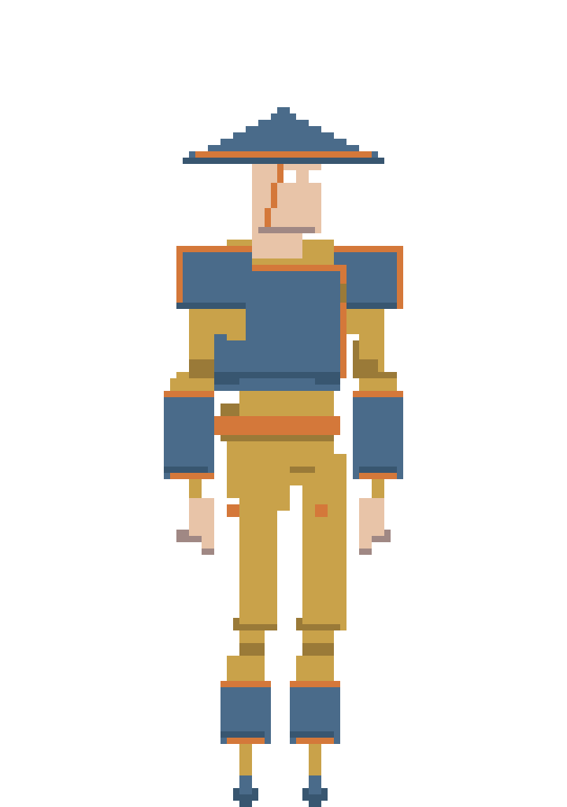

### Walk

Standard side-view walk cycle, 8 frames, natural stride with opposing arm counterbalance. No special requirements beyond reading clearly as a walk.

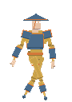

### Run

Run cycle with a wide stride and a forward-driven body. Arms in a high forward pump; the elbow must not break backward behind the torso. Arms reach higher than in the walk.

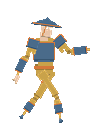

### Attack

Two-handed katana strike. Feet slightly apart and static. Hands locked in the same grip (tips aligned). Raise the katana above the head, then slash downward.

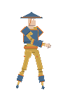

<details>
<summary>Contact sheets</summary>

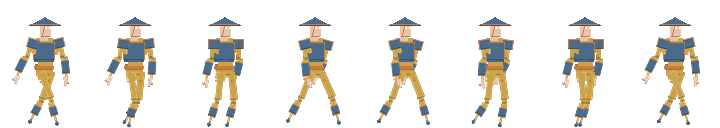

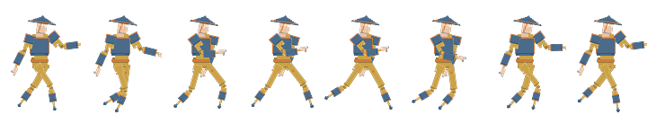

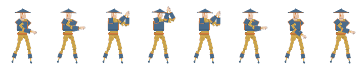

</details>

### Dark mage

**Initial prompt**

> Generate a dark fantasy mage.

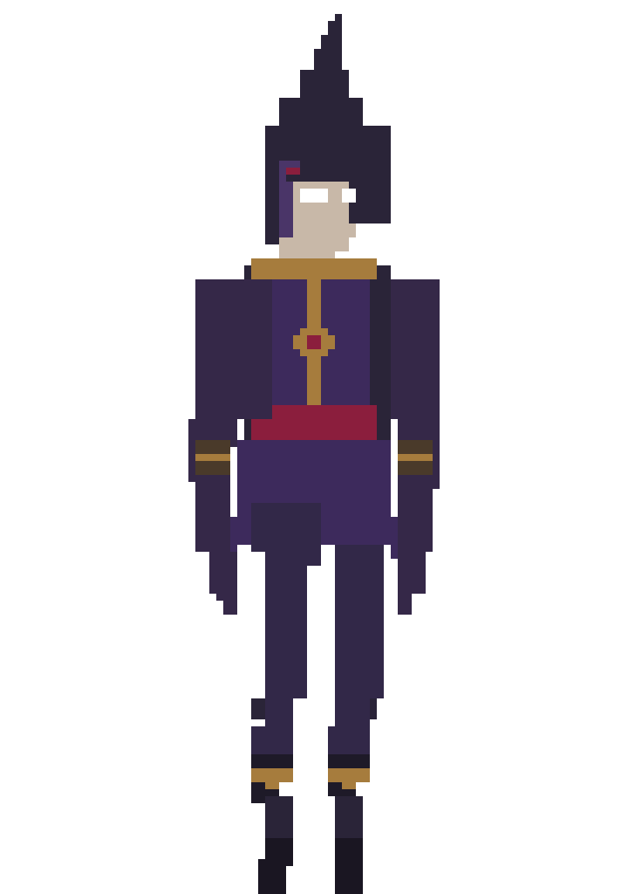

### Medieval warrior (templar)

**Initial prompt**

> Generate a medieval templar warrior. Use sepia colors. Add his armor.

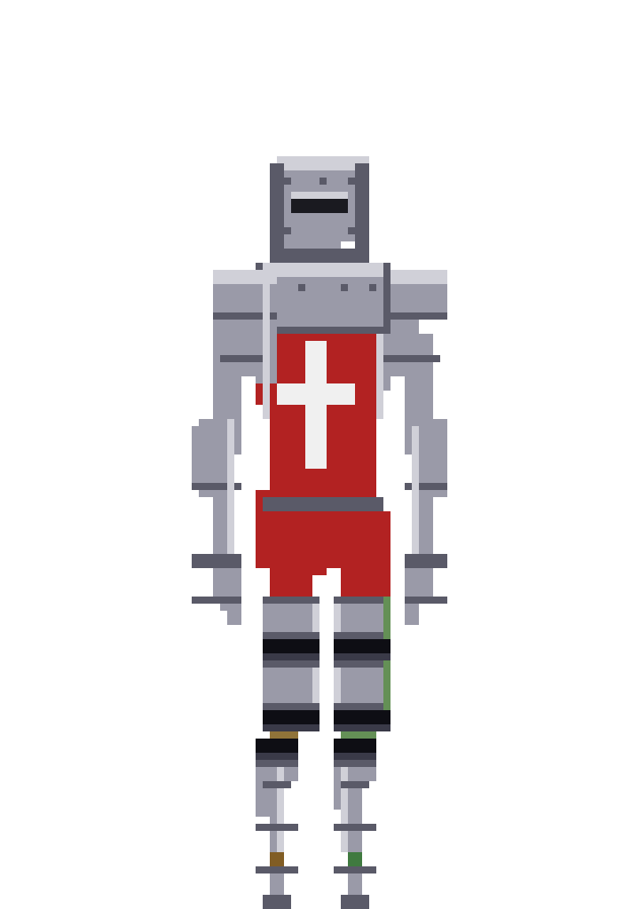

### War orc

**Initial prompt**

> Generate a war orc in battle armor. Sepia palette. Green orc skin, red eyes, metal-colored armor. He carries a red banner with a violet symbol on his back, attached to the torso.

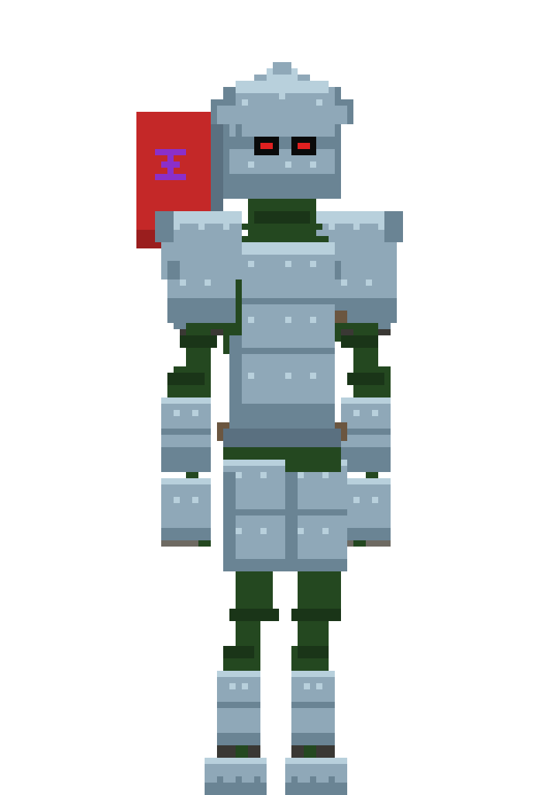

### Desert wanderer

**Initial prompt**

> Crea un personaje vagabundo del desierto, con vendas en todo el cuerpo, color de piel moreno. Ojos amarillos.

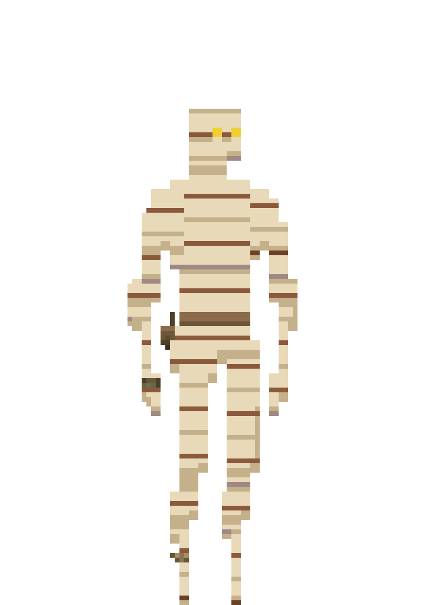

---

## How it works (high level)

The base character is authored once at 90×128. Characters get a copy of that base and its joint pivots, while their appearance is defined by separate design layers.

```text
authored base (90×128)     shared naked armature + eyes
        │
generate_character(name)   copy base + pivots → characters/<name>/base/
        │
plan_outfit → paint        design/layers/*.png (flat colors)
        │
plan_shading → paint       optional hard shadows (one darker step)
        │
compose_character          dressed rest preview
        │
human edit gate            ask → optional open_pixel_editor → re-compose
        │
plan_animation             8 beats + silhouette story
        │
build + finish × 8         joint angles → frame_00..07 + GIF / contact sheet
```

The same joint hierarchy is used for all characters. Clothing follows the body part it belongs to.

**Manual pixel editor**

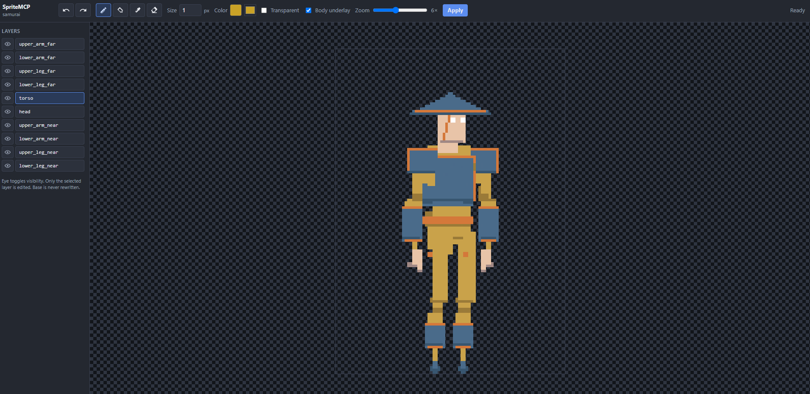

After composing a character, the design can be edited in a local browser UI before animation.

CLI: `python -m spritemcp pixel-editor <name>`

The editor modifies only design/layers/*.png. After applying changes, run compose_character again.

## Requirements

- Python **3.10+**
- [uv](https://docs.astral.sh/uv/) recommended (for `uvx`)
- Dependencies: Pillow + [`mcp`](https://github.com/modelcontextprotocol/python-sdk) (pinned to `mcp<2`)

## Install

### Cursor MCP via `uvx` (recommended)

Add SpriteMCP to your MCP configuration:

```json
{
  "mcpServers": {
    "SpriteMCP": {
      "command": "uvx",
      "args": [
        "--native-tls",
        "--from",
        "git+https://github.com/NicoRMA/SpriteMCP.git",
        "spritemcp"
      ]
    }
  }
}
```

Restart SpriteMCP from Cursor → Settings → MCP.

SpriteMCP can then be used directly through the MCP tools.

See docs/mcp.example.json for the complete configuration.

### Local development

For development or when modifying the source:

```bash
git clone https://github.com/NicoRMA/SpriteMCP.git
cd SpriteMCP
uv sync
```

Then run:

`uv run spritemcp`

The Python package and import name are both spritemcp.

CLI

SpriteMCP also provides a CLI for working without MCP:

```bash
uv run python -m spritemcp paths
uv run python -m spritemcp joints
uv run python -m spritemcp generate-character hero
```

(With uvx: `uvx --from . -- python -m spritemcp paths`.)

Outputs require an explicit root: MCP/agents must call `set_output_root(<project>/output)` before writes (or `SPRITE_GEN_OUTPUT_ROOT` / per-call `output_dir`). Curated showcase characters live in `demo/` (tracked).

## MCP server (Cursor)

Preferred: **`uvx --from … spritemcp`**. Alternatives after editable install: `python -m spritemcp.mcp_server` or `run_mcp_server.py`.

Generated files are written to output/ by default.

### Agent pipeline (do not skip gates)

1. **Required:** `set_output_root(<agent_project>/output)` before any write
2. `generate_character(name)`
3. `plan_outfit` → **show summary, wait for OK** → `prepare_outfit_slot_reference` → paint (`fill_parts_on_slot`, `fill_rect`, `paint_pixels`, …)
4. Recommended: `plan_shading` → paint one-step-darker shadows → `compose_character`
5. **Human edit gate:** ask if the user wants manual edits. If yes → `open_pixel_editor` → Apply → re-`compose_character`. If no → continue.
6. `plan_animation` → **show summary, wait for OK**
7. `(build_frame_animation → finish_frame_animation)` for frames `0..7`

Outfit layers must be painted via MCP paint tools not Shell/PIL one-offs or external image generators. `open_pixel_editor` is the human-only exception after shading+compose.

Full tool table and return schemas: [docs/overview.md](docs/overview.md).

## Layout

```text
SpriteMCP/
  base/                    # authored 90×128 masks + eyes.png
  demo/                    # curated showcase characters (tracked)
  output/                  # local workspace (gitignored)
  docs/
  src/spritemcp/          # Python package (API + MCP server)
  run_mcp_server.py        # preferred MCP entry (PYTHONPATH-safe)
```

Per character (under `output/characters/<name>/` or `demo/<name>/`):

```text
base/                      # shared armature copy
design/
  plan.json
  layers/<layer>.png       # 10 export layers
  compose_preview.png
anims/<anim>/
  plan.json
  frame_00.png … frame_07.png
  <anim>_preview.gif
  <anim>_contact_sheet.png
```

## Public API (summary)

Import from `spritemcp` or `spritemcp.api`. MCP tools use the same names.

| Area | Functions |
|------|-----------|
| Character | `generate_character`, `compose_character` |
| Outfit | `plan_outfit`, `prepare_outfit_slot_reference`, paint tools, `list_outfit_*` |
| Shading | `plan_shading`, `suggest_shade_regions`, `get_shade_palette` |
| Manual edit | `open_pixel_editor` (local browser UI; Apply → `design/layers/`) |
| Animation | `plan_animation`, `build_frame_animation`, `finish_frame_animation`, `export_animation_preview` |
| Rig | `get_joints`, `get_joint_docs`, `get_part_ids`, `get_draw_order`, `get_view_lock` |

Joint names: `neck`, `shoulder_far` / `shoulder_near`, `elbow_far` / `elbow_near`, `hip_far` / `hip_near`, `knee_far` / `knee_near`.

## License

[MIT](LICENSE) — free to download, use, modify, and redistribute in your own projects. Demo art in `demo/` is included under the same license unless a file says otherwise.

## Status

Early public release. APIs may evolve; prefer MCP tool names and `spritemcp.api` as the stable surface. Wrist/ankle pivots and engine-specific importers are not in scope yet.

